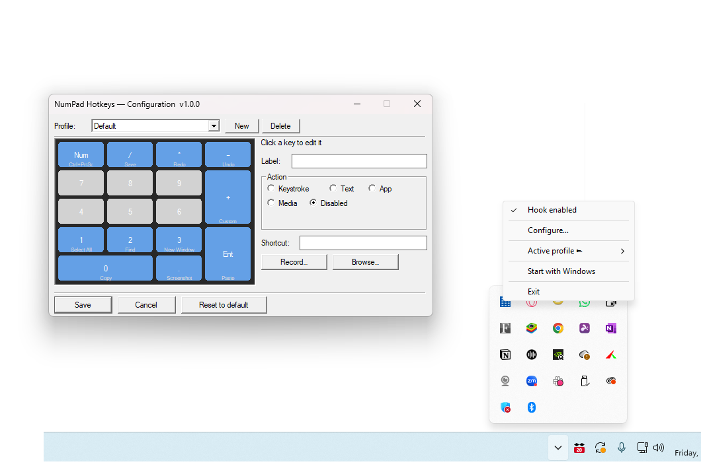

# NumPad Hotkeys

> *"No idea is little."*

---

## The Story

It was a grey Tuesday in Georgia. Rain was tapping against the window in that soft, unhurried way it does in the South — the kind of rain that slows everything down and makes you actually *look* at things.

He was at his desk, coffee going cold beside him, staring at his keyboard. Not at the screen. At the keyboard.

Specifically, at the numeric keypad tucked on the right side — that rectangular island of keys he hadn't deliberately pressed in months. Maybe years. It just sat there, lit by the monitor glow, doing absolutely nothing. Seventeen keys. Every single one of them wasted.

*Seventeen keys*, he thought. *That's seventeen shortcuts I don't have.*

He picked up his coffee. Still warm enough. He took a sip and started writing.

By the time the rain stopped, the first version was running in the system tray.

That's how **NumPad Hotkeys** was born — not from a grand plan or a product brief, but from a quiet afternoon, a neglected corner of a keyboard, and the simple belief that **no idea is little**. Every small frustration is a door. Every overlooked thing is an opportunity waiting for a rainy day.

— *rainyApps.com*

---

## Screenshot



---

## What It Does

NumPad Hotkeys installs a system-wide keyboard hook and intercepts every key on your numeric keypad before any other application sees it. Each key becomes a programmable button — fire a shortcut combo, type a text snippet, launch an app, or trigger a media key. Everything is configured through a visual numpad editor in the system tray.

**Runtime dependencies:** None — Win32 API only (user32, shell32, comctl32, ole32, gdi32)
**Min OS:** Windows 10 (build 1903+)
**Binary size:** ~94 KB

---

## Features

- System-wide numpad interception via `WH_KEYBOARD_LL`
- NumLock-aware: works regardless of NumLock state
- Per-key binding to: keystroke combo, text macro, app launch, media key, or disabled
- Multiple named profiles, switchable from the tray
- Owner-drawn visual numpad with colour-coded binding status
- Type shortcuts directly (`Ctrl + Alt + Shift + PrtSc`) or use the Record button
- Autostart via `HKCU\...\Run` (no admin required)
- Single-instance guard — second launch brings config to front
- Config persisted to `%APPDATA%\NumPadHotkeys\hotkeys.json`
- Clean shutdown: hook uninstalled, tray icon removed, no lingering handles

---

## Build Instructions

### Option A — CMake + MSVC (Visual Studio 2019/2022 Build Tools)

```bat
.\build_msvc.bat
```

Or manually:

```bat
mkdir build && cd build
cmake .. -G "NMake Makefiles" -DCMAKE_BUILD_TYPE=Release
cmake --build .
```

### Option B — CMake + MinGW-w64

```bat
mkdir build && cd build
cmake .. -G "MinGW Makefiles" -DCMAKE_BUILD_TYPE=Release
mingw32-make
```

### Option C — MinGW Makefile (no CMake)

```bat
mingw32-make -f Makefile.mingw
```

---

## Default Bindings (first run)

| Numpad Key | Label       | Action            |
|------------|-------------|-------------------|
| 0          | Copy        | Ctrl + C          |
| Enter      | Paste       | Ctrl + V          |
| .          | Screenshot  | Print Screen      |
| +          | Custom      | Ctrl + Alt + G    |
| −          | Undo        | Ctrl + Z          |
| *          | Redo        | Ctrl + Y          |
| /          | Save        | Ctrl + S          |
| 1          | Select All  | Ctrl + A          |
| 2          | Find        | Ctrl + F          |
| 3          | New Window  | Ctrl + N          |
| 4–9        | (unbound)   | pass through      |
| NumLock    | (never intercepted) | pass through |

---

## Adding a Binding Programmatically

Edit `%APPDATA%\NumPadHotkeys\hotkeys.json`:

```json
{
  "vkCode": 97,
  "extended": false,
  "label": "My Macro",
  "action": "keystroke",
  "keys": [17, 65]
}
```

| Field | Notes |
|-------|-------|
| `vkCode` | VK code (decimal). Numpad 0–9 = 96–105, `.` = 110, `+` = 107, `−` = 109, `*` = 106, `/` = 111 (extended), Enter = 13 (extended) |
| `extended` | `true` for Numpad `/` and Numpad Enter only |
| `action` | `"keystroke"` \| `"text"` \| `"launchapp"` \| `"media"` \| `"disabled"` |
| `keys` | For keystroke: modifier VKs then main key. For media: single `VK_MEDIA_*` code |
| `textOrPath` | For `text` / `launchapp`: the string to type or the `.exe` path |

---

## Typing Shortcuts Manually

In the **Shortcut** field you can type combos directly instead of using **Record**:

```
Ctrl + C
Ctrl + Alt + Shift + PrtSc
Win + R
F12
Ctrl + Shift + F5
```

Tokens are case-insensitive and separated by `+`. Recognised names include:
`Ctrl`, `Alt`, `Shift`, `Win`, `F1`–`F24`, `PrtSc`, `Del`, `Ins`, `Home`, `End`,
`PgUp`, `PgDn`, `Up`, `Down`, `Left`, `Right`, `Esc`, `Tab`, `Space`, `Backspace`,
`Enter`, `VolumeUp`, `VolDown`, `Mute`, `MediaPlay`, `MediaNext`, `MediaPrev`, and all single letters/digits.

---

## Hotkey Conflict Note

NumPad Hotkeys uses `SendInput` to inject replacement keystrokes. If another app has registered a global hotkey for the same combo, both handlers may fire. Prefer unique combos or use the `LaunchApp` / `Text` action types to avoid conflicts.

---

## Uninstalling Completely

1. Right-click tray icon → **Exit**
2. Delete config folder: `%APPDATA%\NumPadHotkeys\`
3. Remove autostart entry (if set):

```bat
reg delete "HKCU\Software\Microsoft\Windows\CurrentVersion\Run" /v NumPadHotkeys /f
rmdir /s /q "%APPDATA%\NumPadHotkeys"
```

---

## License

MIT License — Copyright (c) 2026 [rainyApps.com](https://rainyApps.com)

See [LICENSE](LICENSE) for full text.

---

*Built on a rainy day in Georgia, USA. With a cup of coffee. No idea is little.*
